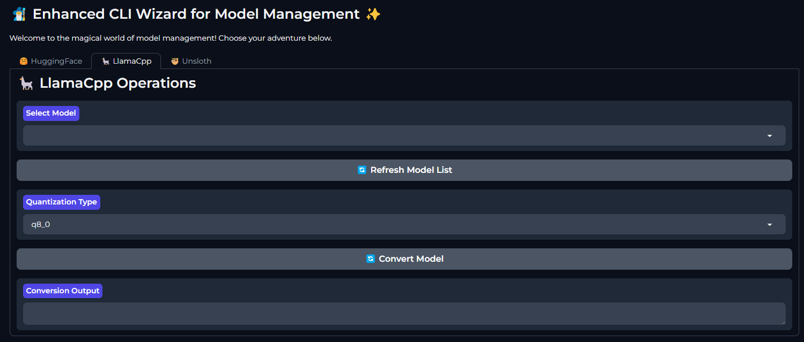
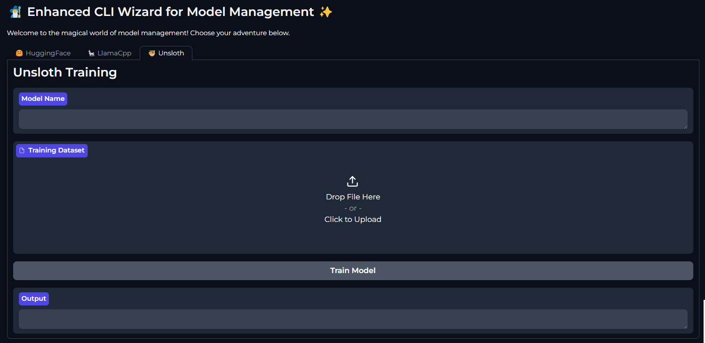
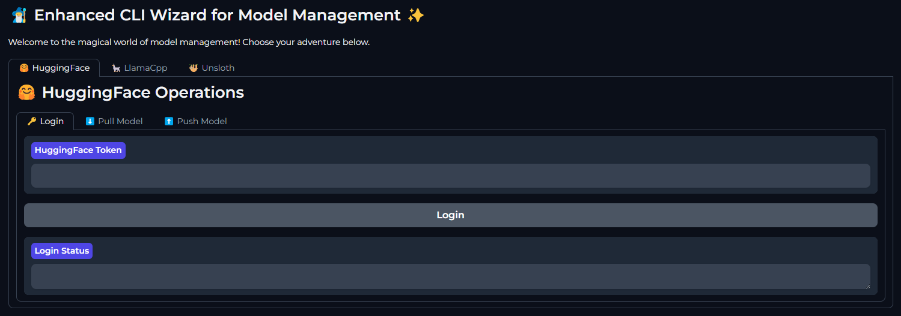

# 🧙‍♂️ AI CLI Toolkit Wizard 🛠️

<p align="center">
  
</p>

Welcome to AI_CLI_Toolkit_Wizard! This powerful set of command-line interface (CLI) tools is designed to streamline your AI model management and processing workflow. From model conversion to training, and from keystroke automation to Hugging Face Hub integration, we've got you covered! 🚀

The AI CLI Toolkit Wizard is a comprehensive suite of tools that wraps around various AI-related CLIs, providing a unified and user-friendly interface for managing your AI models and workflows. It's designed to simplify complex tasks and improve productivity for AI researchers and developers.

## 📚 Table of Contents

- [Installation](#installation)
- [Features](#features)
- [Usage](#usage)
  - [Wizard CLI](#wizard-cli)
  - [Gradio Interface](#gradio-interface)
  - [LlamaCpp GGUF Conversion](#llamacpp-gguf-conversion)
  - [Unsloth Training](#unsloth-training)
  - [Keystroke Macros](#keystroke-macros)
  - [Hugging Face Hub Access](#hugging-face-hub-access)
- [Future Modules](#future-modules)
- [Contributing](#contributing)
- [License](#license)

## 🔧 Installation

1. Clone the repository into your `model_git` folder:
   ```
   git clone https://github.com/yourusername/AI_CLI_Toolkit_Wizard.git model_git/AI_CLI_Toolkit_Wizard
   ```

2. Set up Miniconda (if not already installed):
   - Download and install Miniconda from [here](https://docs.conda.io/en/latest/miniconda.html)
   - Create a new environment:
     ```
     conda create -n ai_toolkit python=3.9
     conda activate ai_toolkit
     ```

3. Install required packages:
   ```
   cd model_git/AI_CLI_Toolkit_Wizard
   pip install -r requirements.txt
   ```

## ✨ Features

- 🔄 LlamaCpp GGUF Conversion: Convert models to GGUF format for optimized inference
- 🦥 Unsloth Training: Fine-tune your models with ease
- ⌨️ Keystroke Macros: Automate repetitive tasks
- 🤗 Hugging Face Hub Access: Seamlessly interact with the Hugging Face ecosystem
- 🧙‍♂️ Wizard CLI: A user-friendly interface to access all tools
- 🌐 Gradio Web Interface: Access tools through an intuitive web-based GUI

## 🚀 Usage

### Wizard CLI

The Wizard CLI is your gateway to all the tools. Run it with:

```
python CLI_wizard.py
```

Follow the interactive prompts to access different features.

### Gradio Interface

Launch the Gradio web interface for a more visual interaction:

```
python CLI_wizard.py gradio
```

This will start a local web server, and you can access the interface through your browser. The Gradio interface provides easy-to-use forms and buttons for each tool, making it accessible even for those less comfortable with command-line interfaces.

### LlamaCpp GGUF Conversion

Convert models to GGUF format:

```
python llamacpp_tools_CLI.py convert --input_dir /path/to/model --model_name model_name --output_dir /path/to/output --quant_type q8_0
```

<p align="center">
  
</p>

### Unsloth Training

Fine-tune your models:

```
python unsloth-cli-2.py train --model_name "your_model_path" --train_dataset "train.parquet" --output_dir "outputs"
```

<p align="center">
  
</p>

### Keystroke Macros

Create and run keystroke macros:

```
python Keystrokes_CLI.py create "my_macro" --actions "mouse_move 100 100" "key_press a"
python Keystrokes_CLI.py execute "my_macro"
```

### Hugging Face Hub Access

Interact with Hugging Face Hub:

```
python HF_CLI.py pull --model_name "bert-base-uncased"
python HF_CLI.py push --local_path "./my_model" --repo_name "my-username/my-model"
```

<p align="center">
  
</p>

## 🔮 Future Modules

We're constantly working to expand AI_CLI_Toolkit_Wizard. Here are some exciting modules we plan to add in the future:

- 🤖 Autotrainer: Automated model training pipeline
- 🪓 Axolotl: Advanced model fine-tuning
- 🔧 PEFT: Parameter-Efficient Fine-Tuning
- 🏋️ TRL: Transformer Reinforcement Learning
- 🎓 SFT: Supervised Fine-Tuning
- 🦥 Lazy Merge Kit: Effortless model merging
- 🐼 Pandas Datasets: Enhanced dataset management
- 🐟 Coqui/Whisper Streaming: Real-time speech recognition
- 🎵 Musetalk: Music generation and analysis
- 🦙 Ollama LLM Chatbot: Local LLM-powered chatbot
- 🕵️ Ollama LLM Research Agent: AI-assisted research tool
- 👥 CrewAI: Multi-agent AI systems
- 📊 TensorBoard: Enhanced model visualization
- 🎨 Stable Diffusion 3: Next-gen image generation
- 🌊 Cascade: Advanced image processing
- 🖼️ Stable Diffusion LoRA: Fine-tuning for image generation models

Stay tuned for these exciting additions! 🌟

## 🤝 Contributing

We welcome contributions! If you have ideas for improvements or new features, please open an issue or submit a pull request.

## 📄 License

This project is licensed under the MIT License - see the [LICENSE](LICENSE) file for details.

---

Happy AI tooling! If you have any questions or need assistance, don't hesitate to reach out. 🚀🧙‍♂️